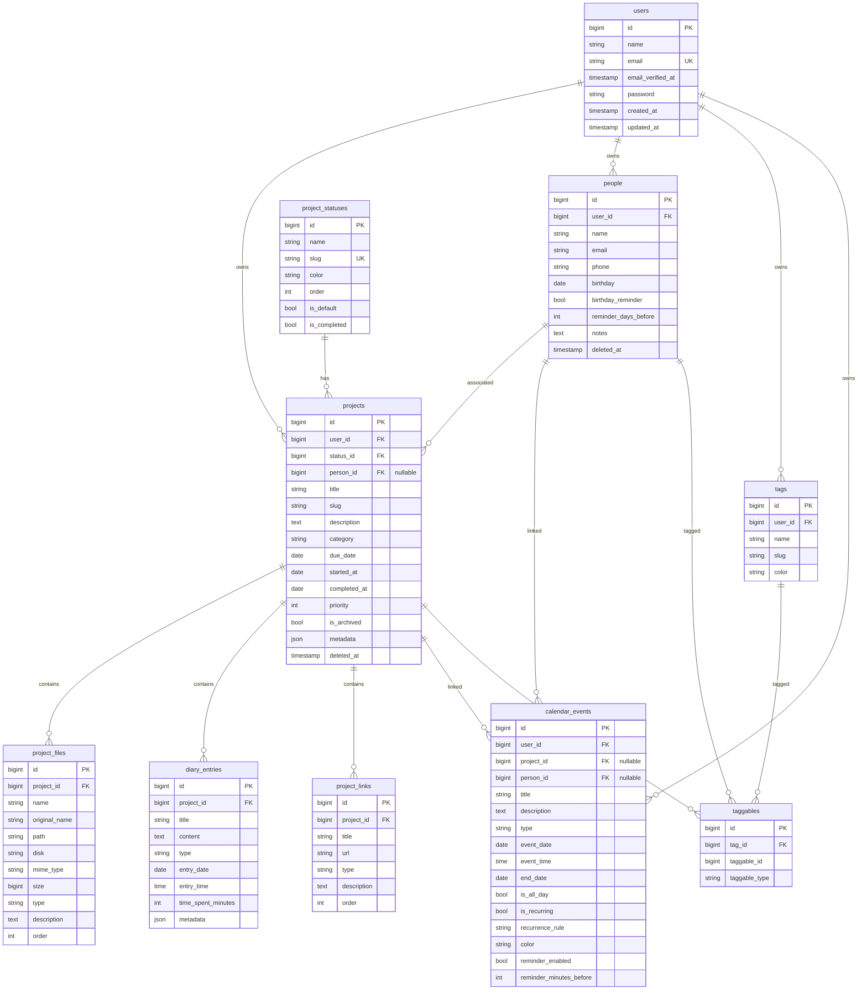

# DIY Project Manager

Aplicación Laravel 12 para gestión de proyectos DIY (carpintería, impresión 3D, arte en papel, etc.)

## Requisitos

- PHP 8.4+
- Docker & Docker Compose (para Sail)
- Composer

## Instalación

```bash
# Clonar repositorio
git clone <repo-url> buil-diary
cd buil-diary

# Instalar dependencias
composer install

# Copiar configuración
cp .env.example .env

# Iniciar contenedores
./vendor/bin/sail up -d

# Generar clave
./vendor/bin/sail artisan key:generate

# Ejecutar migraciones y seeders
./vendor/bin/sail artisan migrate --seed

# Compilar assets (si usas frontend)
./vendor/bin/sail npm install && ./vendor/bin/sail npm run build
```

## Estructura del Proyecto

```
app/
├── Data/                           # DTOs (Data Transfer Objects)
│   ├── CalendarEventData.php
│   ├── DiaryEntryData.php
│   ├── PersonData.php
│   └── ProjectData.php
├── Http/
│   ├── Controllers/                # Controladores delgados
│   │   ├── CalendarController.php
│   │   ├── DashboardController.php
│   │   ├── DiaryEntryController.php
│   │   ├── PersonController.php
│   │   ├── ProjectController.php
│   │   ├── ProjectFileController.php
│   │   ├── ProjectLinkController.php
│   │   └── TagController.php
│   └── Requests/                   # Form Requests
│       ├── Calendar/
│       ├── Diary/
│       ├── Person/
│       ├── Project/
│       └── Tag/
├── Models/                         # Eloquent Models
│   ├── Concerns/
│   │   └── HasTags.php            # Trait para tagging polimórfico
│   ├── CalendarEvent.php
│   ├── DiaryEntry.php
│   ├── Person.php
│   ├── Project.php
│   ├── ProjectFile.php
│   ├── ProjectLink.php
│   ├── ProjectStatus.php
│   ├── Tag.php
│   └── User.php
├── Policies/                       # Authorization Policies
│   ├── CalendarEventPolicy.php
│   ├── DiaryEntryPolicy.php
│   ├── PersonPolicy.php
│   ├── ProjectFilePolicy.php
│   ├── ProjectPolicy.php
│   └── TagPolicy.php
└── Services/                       # Business Logic (Actions)
    ├── Calendar/
    │   └── CalendarService.php
    ├── Dashboard/
    │   └── DashboardService.php
    ├── Diary/
    │   ├── CreateDiaryEntryAction.php
    │   └── UpdateDiaryEntryAction.php
    ├── File/
    │   ├── DeleteProjectFileAction.php
    │   └── UploadProjectFileAction.php
    └── Project/
        ├── ArchiveProjectAction.php
        ├── CreateProjectAction.php
        ├── DeleteProjectAction.php
        └── UpdateProjectAction.php

database/
├── factories/                      # Model Factories
├── migrations/                     # Database Migrations
└── seeders/
    └── ProjectStatusSeeder.php     # Estados por defecto

tests/
└── Feature/                        # Feature Tests
    ├── CalendarTest.php
    ├── DiaryEntryTest.php
    ├── PersonTest.php
    ├── ProjectTest.php
    └── TagTest.php
```

## Diagrama de Relaciones (ERD)



## Relaciones Detalladas

| Modelo | Relación | Modelo Relacionado | Tipo |
|--------|----------|-------------------|------|
| User | hasMany | Project | 1:N |
| User | hasMany | Person | 1:N |
| User | hasMany | Tag | 1:N |
| User | hasMany | CalendarEvent | 1:N |
| Project | belongsTo | User | N:1 |
| Project | belongsTo | ProjectStatus | N:1 |
| Project | belongsTo | Person (opcional) | N:1 |
| Project | hasMany | ProjectFile | 1:N |
| Project | hasMany | DiaryEntry | 1:N |
| Project | hasMany | ProjectLink | 1:N |
| Project | hasMany | CalendarEvent | 1:N |
| Project | morphToMany | Tag | M:N |
| Person | belongsTo | User | N:1 |
| Person | hasMany | Project | 1:N |
| Person | morphToMany | Tag | M:N |
| Tag | morphedByMany | Project | M:N |
| Tag | morphedByMany | Person | M:N |
| CalendarEvent | belongsTo | User | N:1 |
| CalendarEvent | belongsTo | Project (opcional) | N:1 |
| CalendarEvent | belongsTo | Person (opcional) | N:1 |

## Comandos Útiles

```bash
# Ejecutar tests
./vendor/bin/sail test

# Ejecutar PHPStan
./vendor/bin/sail php ./vendor/bin/phpstan analyse

# Ejecutar Pint (formatter)
./vendor/bin/sail php ./vendor/bin/pint

# Refrescar base de datos
./vendor/bin/sail artisan migrate:fresh --seed
```

## API Endpoints

### Projects
| Método | Ruta | Acción |
|--------|------|--------|
| GET | `/projects` | Listar proyectos |
| POST | `/projects` | Crear proyecto |
| GET | `/projects/{project}` | Ver proyecto |
| PUT | `/projects/{project}` | Actualizar proyecto |
| DELETE | `/projects/{project}` | Eliminar proyecto |
| POST | `/projects/{project}/archive` | Archivar |
| POST | `/projects/{project}/unarchive` | Desarchivar |

### Project Files
| Método | Ruta | Acción |
|--------|------|--------|
| GET | `/projects/{project}/files` | Listar archivos |
| POST | `/projects/{project}/files` | Subir archivos |
| GET | `/projects/{project}/files/{file}/download` | Descargar |
| DELETE | `/projects/{project}/files/{file}` | Eliminar |

### Diary Entries
| Método | Ruta | Acción |
|--------|------|--------|
| GET | `/projects/{project}/diary` | Listar entradas |
| POST | `/projects/{project}/diary` | Crear entrada |
| PUT | `/projects/{project}/diary/{entry}` | Actualizar |
| DELETE | `/projects/{project}/diary/{entry}` | Eliminar |

### Project Links
| Método | Ruta | Acción |
|--------|------|--------|
| GET | `/projects/{project}/links` | Listar enlaces |
| POST | `/projects/{project}/links` | Crear enlace |
| PUT | `/projects/{project}/links/{link}` | Actualizar |
| DELETE | `/projects/{project}/links/{link}` | Eliminar |

### People
| Método | Ruta | Acción |
|--------|------|--------|
| GET | `/people` | Listar personas |
| POST | `/people` | Crear persona |
| GET | `/people/{person}` | Ver persona |
| PUT | `/people/{person}` | Actualizar |
| DELETE | `/people/{person}` | Eliminar |

### Tags
| Método | Ruta | Acción |
|--------|------|--------|
| GET | `/tags` | Listar etiquetas |
| POST | `/tags` | Crear etiqueta |
| PUT | `/tags/{tag}` | Actualizar |
| DELETE | `/tags/{tag}` | Eliminar |

### Calendar
| Método | Ruta | Acción |
|--------|------|--------|
| GET | `/calendar` | Ver eventos del mes |
| GET | `/calendar/upcoming` | Eventos próximos |
| POST | `/calendar/events` | Crear evento |
| PUT | `/calendar/events/{event}` | Actualizar |
| DELETE | `/calendar/events/{event}` | Eliminar |

## Paquetes Recomendados

### Ya Instalados
- `laravel/sail` - Docker development environment

### Recomendados para Instalar

```bash
# Autenticación
composer require laravel/breeze --dev
php artisan breeze:install

# Procesamiento de imágenes
composer require spatie/laravel-medialibrary

# Exportación de datos
composer require maatwebsite/excel

# Actividad/Auditoría
composer require spatie/laravel-activitylog

# Backups
composer require spatie/laravel-backup

# API Resources mejorados
composer require spatie/laravel-query-builder

# Permisos avanzados (si se necesitan roles)
composer require spatie/laravel-permission

# Notificaciones Slack
composer require laravel/slack-notification-channel

# Testing mejorado
composer require pestphp/pest --dev
composer require pestphp/pest-plugin-laravel --dev

# IDE Helper
composer require barryvdh/laravel-ide-helper --dev

# Debugging
composer require barryvdh/laravel-debugbar --dev
```

## Roadmap de Evolución

### Fase 1 - MVP (Actual) ✅
- [x] CRUD de proyectos con estados configurables
- [x] Sistema de personas con cumpleaños
- [x] Subida de múltiples archivos
- [x] Diario del proyecto (timeline)
- [x] Enlaces externos
- [x] Sistema de etiquetas reutilizables
- [x] Calendario con fechas/cumpleaños/eventos
- [x] Dashboard con estadísticas
- [x] Policies para autorización
- [x] Form Requests para validación
- [x] Tests básicos

### Fase 2 - Mejoras UX
- [ ] Interfaz Livewire o Inertia.js
- [ ] Drag & drop para archivos
- [ ] Rich text editor (Trix/TipTap) para diario
- [ ] Vista Kanban de proyectos
- [ ] Búsqueda full-text con Scout
- [ ] Modo oscuro

### Fase 3 - Características Avanzadas
- [ ] Plantillas de proyectos reutilizables
- [ ] Subtareas/checklist dentro de proyectos
- [ ] Estimación de costes y presupuesto
- [ ] Lista de materiales (BOM)
- [ ] Galería de fotos con lightbox
- [ ] Previsualización 3D de archivos STL

### Fase 4 - Colaboración
- [ ] Compartir proyectos (público/privado/por enlace)
- [ ] Comentarios en proyectos y entradas
- [ ] Exportar proyecto completo a PDF
- [ ] Importar/Exportar datos (JSON/CSV)
- [ ] Webhooks para integraciones

### Fase 5 - Integraciones
- [ ] Sincronización con Google Calendar
- [ ] Notificaciones push (FCM/WebPush)
- [ ] Integración con proveedores (scraping precios)
- [ ] API pública con documentación OpenAPI
- [ ] Zapier/Make integrations

### Fase 6 - Mobile & PWA
- [ ] Progressive Web App completa
- [ ] Modo offline con sync
- [ ] Cámara para capturar fotos directamente
- [ ] App nativa Flutter/React Native (opcional)

## Principios Aplicados

### SOLID
- **S**ingle Responsibility: Cada clase tiene una única responsabilidad
- **O**pen/Closed: Services extensibles sin modificar código existente
- **L**iskov Substitution: Traits y herencia correctamente aplicados
- **I**nterface Segregation: Form Requests específicos por acción
- **D**ependency Inversion: Inyección de dependencias en constructores

### Clean Architecture
- **Controladores delgados**: Solo coordinan Request → Service → Response
- **Services/Actions**: Encapsulan lógica de negocio compleja
- **Form Requests**: Validación y sanitización separada del controlador
- **Policies**: Autorización centralizada y reutilizable
- **DTOs**: Datos estructurados y tipados entre capas

### Otras Buenas Prácticas
- `declare(strict_types=1)` en todos los archivos
- Clases `final` donde no se requiere extensión
- Typed properties y return types completos
- Scopes reutilizables en modelos Eloquent
- Factories para testing determinístico
- Feature tests para flujos de usuario completos
- Baja complejidad ciclomática (métodos pequeños y enfocados)

## Licencia

MIT License - ver [LICENSE](LICENSE) para más detalles.
